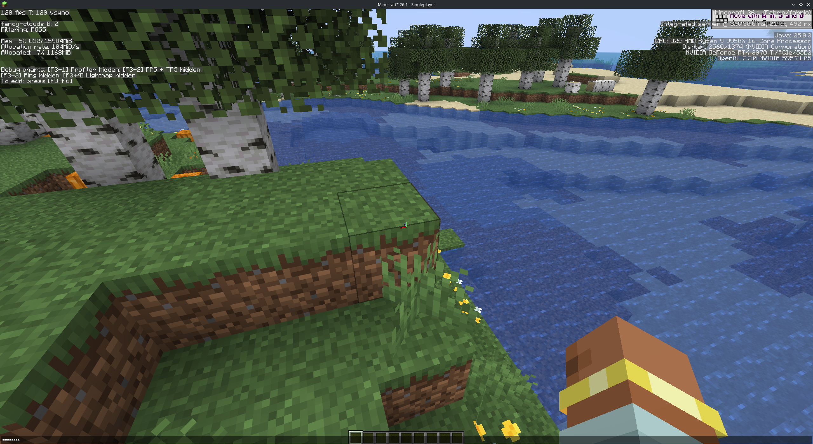
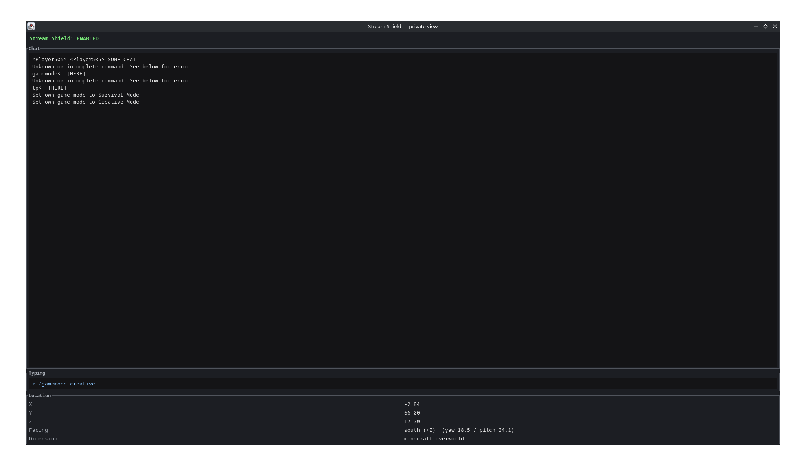

# Stream Shield

A Fabric client mod that hides chat, F3 coordinates, and what you're typing from the game window, and mirrors them to a separate desktop window only you can see. Capture or share the Minecraft window without leaking DMs, server IPs, command history, or your location.

Client-side only. Vanilla servers welcome.

## How it works

**In the game window**, when Stream Shield is enabled:

- Incoming chat is suppressed (the chat box is hidden entirely).
- Typing into chat shows mask characters in place of every character — no black bar, just bullets where your text would be.
- Command suggestions (the popup above the input and the inline gray autocomplete) are hidden.
- F3 lines that reveal your position (coords, facing, biome, world seed, etc.) are scrambled.



**In the secondary window** ("Stream Shield — private view"), you see the real thing:

- Full chat log, including messages received while obfuscation was on.
- What you're currently typing (live).
- Your real coordinates, facing, and dimension.



Park the secondary window on a second monitor (or anywhere your capture software doesn't see) and stream the Minecraft window normally.

## Requirements

- Minecraft **26.1** (snapshot tooling — adjust `gradle.properties` for other versions)
- Fabric Loader `>= 0.18.4`
- [Fabric API](https://modrinth.com/mod/fabric-api)
- [Fabric Language Kotlin](https://modrinth.com/mod/fabric-language-kotlin) `>= 1.13.10+kotlin.2.3.20`
- A desktop environment (the mod opens a Swing window — won't work on a headless setup)

## Usage

1. Drop the jar into your Fabric `mods/` folder alongside Fabric API and Fabric Language Kotlin.
2. Launch Minecraft. The private-view window opens (or stays hidden, depending on config).
3. Bind a key for **Stream Shield → Toggle obfuscation** under *Options → Controls → Key Binds*. (No default binding.)
4. Press the key to toggle. The private-view window's status header turns green when shielding is active.

## Configuration

Config lives at `<minecraft>/stream_shield.json` and is generated on first launch:

```json
{
  "enabledByDefault": false,
  "showSecondaryWindowWhenEnabled": true,
  "maskCharacter": "•",
  "windowBounds": null
}
```

| Field | Purpose |
| --- | --- |
| `enabledByDefault` | Start the game with shielding already on. |
| `showSecondaryWindowWhenEnabled` | Auto-show/hide the private view when you toggle. Set `false` to manage the window manually. |
| `maskCharacter` | Character drawn in the chat input in place of each typed character. |
| `windowBounds` | Last saved position/size of the private view (written automatically). |

## Building from source

```sh
./gradlew build
```

The jar lands in `build/libs/`.

## License

Apache-2.0
